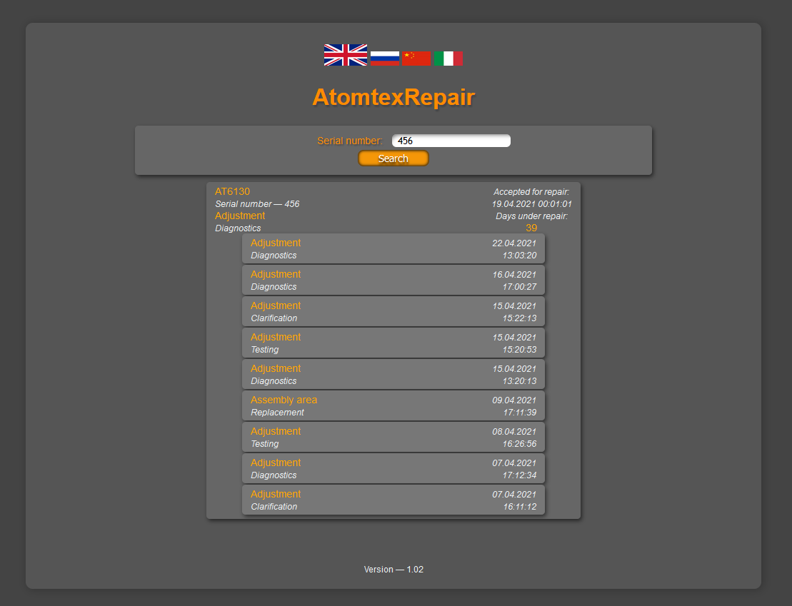

# AtomtexRepair 1.04    
### <i>Сайт для отслеживания статусов ремонтных устройств. По введенному серийному находит в БД устройство и отображает инфо по нему. При клике на панельку устройства разворачивается список событий этого устройства (в хронологическом порядке, самое новое вверху)</i> 

[Список версий](./VERSION.md)

[comment]: <> (![alt tag]&#40;fon.png&#41;)
